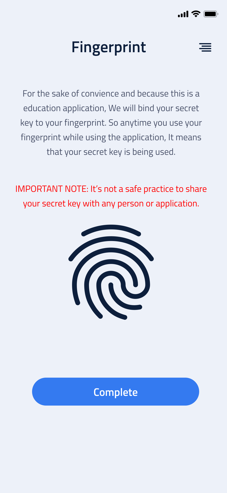

# MindBlock - The Blockchain App


Uses ReactNative to build a cross-platofrom app.

<a name="readme-top"></a>


<!-- PROJECT SHIELDS -->
<!--
*** I'm using markdown "reference style" links for readability.
*** Reference links are enclosed in brackets [ ] instead of parentheses ( ).
*** See the bottom of this document for the declaration of the reference variables
*** for contributors-url, forks-url, etc. This is an optional, concise syntax you may use.
*** https://www.markdownguide.org/basic-syntax/#reference-style-links
-->
[![Contributors][contributors-shield]][contributors-url]
[![Forks][forks-shield]][forks-url]
[![Stargazers][stars-shield]][stars-url]
[![Issues][issues-shield]][issues-url]
[![MIT License][license-shield]][license-url]
[![LinkedIn][linkedin-shield]][linkedin-url]


<!-- PROJECT LOGO -->
<br />
<div align="center">
  <a href="https://github.com/aarav22/MindBlock">
    
  </a>

<h3 align="center">MindBlock</h3>

  <p align="center">
   simplifies the complexities of Bitcoin and blockchain technology through analogies, aiming to provide users with an intuitive learning experience. Our goal is to serve as an educational platform where individuals can easily grasp lesser-known aspects of cryptocurrencies. We employ a blend of text, visuals, and interactive tools to achieve this, always prioritizing a user-friendly learning journey. 
    <br />
    <a href="https://github.com/aarav22/MindBlock"><strong>Explore the docs »</strong></a>
    <br />
    <br />
    <!-- <a href="https://github.com/aarav22/MindBlock">View Demo</a> -->
    ·
    <a href="https://github.com/aarav22/MindBlock/issues">Report Bug</a>
    ·
    <a href="https://github.com/aarav22/MindBlock/issues">Request Feature</a>
  </p>
</div>


<!-- TABLE OF CONTENTS -->
<details>
  <summary>Table of Contents</summary>
  <ol>
    <li>
      <a href="#about-the-project">About The Project</a>
      <ul>
        <li><a href="#built-with">Built With</a></li>
      </ul>
    </li>
    <li>
      <a href="#getting-started">Getting Started</a>
      <ul>
        <li><a href="#prerequisites">Prerequisites</a></li>
        <li><a href="#installation">Installation</a></li>
      </ul>
    </li>
    <li><a href="#usage">Usage</a></li>
    <li><a href="#contributing">Contributing</a></li>
    <li><a href="#license">License</a></li>
  </ol>
</details>


<!-- ABOUT THE PROJECT -->
## About The Project


Cryptocurrencies have gained a lot of popularity in recent years, People are investing a lot of money into that market. As of April 16th 2021, Bitcoin is valued at $ 63,237.  That’s the financial market side of things. Bitcoin, however, is a lot more than that. Bitcoin in it’s true sense is a decentralized peer to peer payment system. There’s no single body that lies at the heart of bitcoin. Bitcoin was truly groundbreaking when it was first announced.

The Application is divided into modules (7 of them) to maintain a consistent flow of information. Each module focuses on one aspect of Bitcoin. To move onto the next module, a user must complete the previous modules. The module names are as follows: 
1. What is Bitcoin?
2. Address & Secret Key
3. Address Generation
4. What is a Bitcoin Transaction?
5. Transaction Creation
6. Blockchain Architecture
7. Anatomy of a Transaction. 
 


### Built With

* [![ReactNative][ReactNative]][ReactNative-url]
* [BlockCypher API](https://www.blockcypher.com/dev/bitcoin/) (to make transactions)

<p align="right">(<a href="#readme-top">back to top</a>)</p>


<!-- GETTING STARTED -->
## Getting Started

To get a local copy up and running follow these simple example steps.

### Prerequisites

* ReactNative Setup

### Installation

1. Set up an account on BlockCypher
2. Clone the repo
   ```sh
   git clone https://github.com/aarav22/MindBlock.git
   ```
3. Enter your API Keys in `.env`

<p align="right">(<a href="#readme-top">back to top</a>)</p>


<!-- USAGE EXAMPLES -->
## Images
<!-- [![product shot 1][product-shot-1]](#) -->




<!-- [![product shot 3][product-shot-3]](#)
[![product shot 4][product-shot-4]](#) -->
<p align="right">(<a href="#readme-top">back to top</a>)</p>

## Links
1. Application: [APK](https://drive.google.com/drive/folders/1N99I2qs8V7FVjOYwx48Y4O9QT7rUXRAl?usp=sharing)
2. Application Demo: [App Demo](https://drive.google.com/file/d/1uMmACfQlEZtecamnmhr0Jqy-_C8-C5uV/view?usp=sharing), [API Demo](https://drive.google.com/file/d/1uMmACfQlEZtecamnmhr0Jqy-_C8-C5uV/view?usp=sharing)
3. Application Wireframes: [Here](https://www.figma.com/file/7NdmHaVLKVq6mnQPasDMLA/Whollet-UI-Kit-v1.0-Copy?node-id=244%3A15400)
4. Support for bitcoin-lib-js: https://gist.github.com/coreyphillips/4d45160fed016417a5f583f179c2cbdb

<!-- CONTRIBUTING -->
## Contributing

Contributions are what make the open source community such an amazing place to learn, inspire, and create. Any contributions you make are **greatly appreciated**.

If you have a suggestion that would make this better, please fork the repo and create a pull request. You can also simply open an issue with the tag "enhancement".
Don't forget to give the project a star! Thanks again!

1. Fork the Project
2. Create your Feature Branch (`git checkout -b feature/AmazingFeature`)
3. Commit your Changes (`git commit -m 'Add some AmazingFeature'`)
4. Push to the Branch (`git push origin feature/AmazingFeature`)
5. Open a Pull Request

<p align="right">(<a href="#readme-top">back to top</a>)</p>


<!-- LICENSE -->
## License

Distributed under the MIT License. See `LICENSE.txt` for more information.

<p align="right">(<a href="#readme-top">back to top</a>)</p>


<!-- MARKDOWN LINKS & IMAGES -->
<!-- https://www.markdownguide.org/basic-syntax/#reference-style-links -->
[contributors-shield]: https://img.shields.io/github/contributors/aarav22/MindBlock.svg?style=for-the-badge
[contributors-url]: https://github.com/aarav22/MindBlock/graphs/contributors
[forks-shield]: https://img.shields.io/github/forks/aarav22/MindBlock.svg?style=for-the-badge
[forks-url]: https://github.com/aarav22/MindBlock/network/members
[stars-shield]: https://img.shields.io/github/stars/aarav22/MindBlock.svg?style=for-the-badge
[stars-url]: https://github.com/aarav22/MindBlock/stargazers
[issues-shield]: https://img.shields.io/github/issues/aarav22/MindBlock.svg?style=for-the-badge
[issues-url]: https://github.com/aarav22/MindBlock/issues
[license-shield]: https://img.shields.io/github/license/aarav22/MindBlock.svg?style=for-the-badge
[license-url]: https://github.com/aarav22/MindBlock/blob/master/LICENSE.txt
[linkedin-shield]: https://img.shields.io/badge/-LinkedIn-black.svg?style=for-the-badge&logo=linkedin&colorB=555
[linkedin-url]: https://linkedin.com/in/aarav22
[arch-img]: images/graph_img.jpeg
[product-screenshot]: images/app_img.jpeg
[product-shot-1]: images/graph_img.jpeg
[product-shot-2]: images/loading_img.png
[product-shot-3]: images/otp_img.png
[product-shot-4]: images/gallery_img.png
[Next.js]: https://img.shields.io/badge/next.js-000000?style=for-the-badge&logo=nextdotjs&logoColor=white
[Next-url]: https://nextjs.org/
[ReactNative]: https://img.shields.io/badge/react_native-%2320232a.svg?style=for-the-badge&logo=react&logoColor=%2361DAFB
[ReactNative-url]: https://reactnative.dev/
[Strapi]: https://camo.githubusercontent.com/7b181416931b19e4f5c19a139a9f8609621f9b8350f266f543bf19f93c7bf219/68747470733a2f2f7374726170692e696f2f6173736574732f7374726170692d6c6f676f2d6c696768742e737667
[Node.js]: https://img.shields.io/badge/node.js-6DA55F?style=for-the-badge&logo=node.js&logoColor=white
[Node.js-url]: https://nodejs.org/
[Express.js]: https://img.shields.io/badge/express.js-%23404d59.svg?style=for-the-badge&logo=express&logoColor=%2361DAFB
[Express.js-url]:http://expressjs.com
[Neo4j]: https://img.shields.io/badge/Neo4j-008CC1?style=for-the-badge&logo=neo4j&logoColor=white
[Neo4j-url]: https://neo4j.com/
[Strapi-url]: https://github.com/strapi/strapi
[React.js]: https://img.shields.io/badge/React-20232A?style=for-the-badge&logo=react&logoColor=61DAFB
[React-url]: https://reactjs.org/
[Vue.js]: https://img.shields.io/badge/Vue.js-35495E?style=for-the-badge&logo=vuedotjs&logoColor=4FC08D
[Vue-url]: https://vuejs.org/
[Angular.io]: https://img.shields.io/badge/Angular-DD0031?style=for-the-badge&logo=angular&logoColor=white
[Angular-url]: https://angular.io/
[Svelte.dev]: https://img.shields.io/badge/Svelte-4A4A55?style=for-the-badge&logo=svelte&logoColor=FF3E00
[Svelte-url]: https://svelte.dev/
[Laravel.com]: https://img.shields.io/badge/Laravel-FF2D20?style=for-the-badge&logo=laravel&logoColor=white
[Laravel-url]: https://laravel.com
[Bootstrap.com]: https://img.shields.io/badge/Bootstrap-563D7C?style=for-the-badge&logo=bootstrap&logoColor=white
[Bootstrap-url]: https://getbootstrap.com
[JQuery.com]: https://img.shields.io/badge/jQuery-0769AD?style=for-the-badge&logo=jquery&logoColor=white
[JQuery-url]: https://jquery.com 

